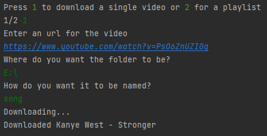
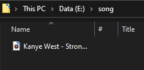
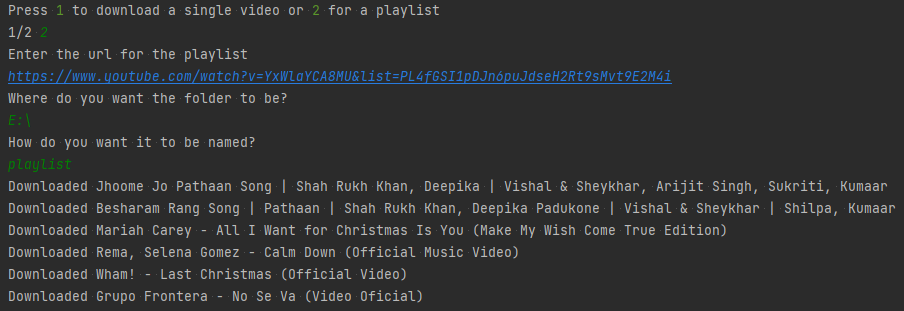
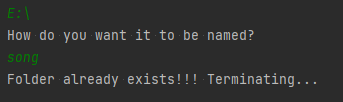

# youtube-to-mp3-converter
A Python script that converts a YouTube video or a playlist into a MP3 file and saves it wherever you want.

## Different options
- `Download a single video` 

  
  

- `Download a playlist`

  
  

## Error message

When an already existing folder name is given the program terminates itself and gives you this message 

